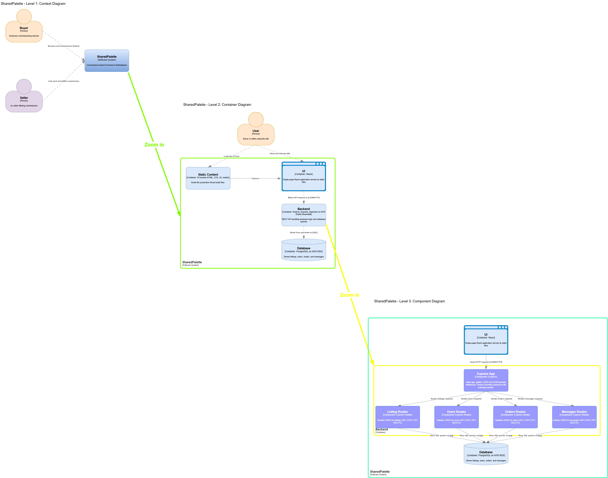
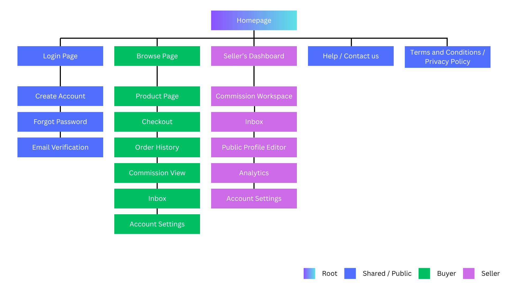
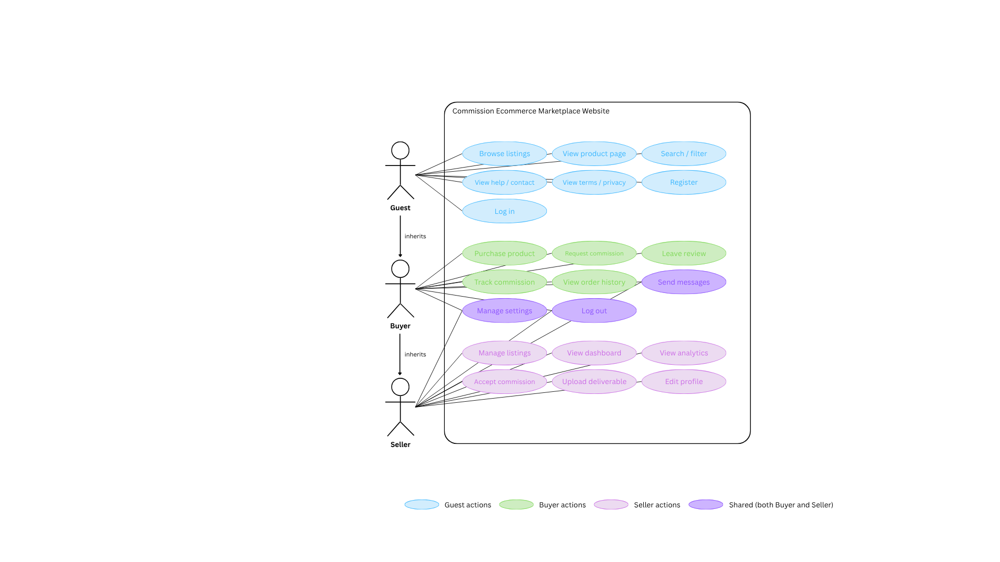

# SharedPalette

A full-stack commission art marketplace built with React, Node.js, Express, and PostgreSQL, deployed on AWS.

Buyers can browse artists by specialty, place commissions, and chat with sellers throughout the process. Sellers can manage their listings, track active commissions, and deliver work to clients. 

Project for INF 124: Internet Application Engineering

## Live Demo

- **Frontend**: https://d1mpjs6zvo988o.cloudfront.net
- **Backend API**: https://dns1np3p6h3lb.cloudfront.net
- **Frontend repo**: [github.com/YMONGUCHI/sharedpalette](https://github.com/YMONGUCHI/sharedpalette)
- **Backend repo**: [github.com/YMONGUCHI/sharedpalette-backend.git](https://github.com/YMONGUCHI/sharedpalette-backend.git)
- **Demo video**: [Will add later]
- **Jira project board**: [link to Jira board](https://ymonguch.atlassian.net/jira/software/projects/KAN/boards/1?jql=&atlOrigin=eyJpIjoiYjAyZTU4MWEwNzI4NGU2ZGIzMjM3MGFhOTc2NzAwNjMiLCJwIjoiaiJ9)

## Tech Stack

**Frontend**
- React 19
- React Router v7 for client-side routing
- Plain CSS (no framework)
- Hosted on AWS S3 with static website hosting
- Distributed via AWS CloudFront for HTTPS

**Backend**
- Node.js with Express
- `pg` library for PostgreSQL connection pooling
- `cors` middleware for cross-origin requests
- `dotenv` for environment variable management
- `bcrypt` for password hashing
- `jsonwebtoken` for JWT-based authentication
- Hosted on AWS Elastic Beanstalk

**Database**
- PostgreSQL 18 on AWS RDS (db.t4g.micro, free tier)

**Tools**
- VS Code for development
- Postman for API testing
- draw.io for A3/A4 architecture diagrams
- canva for Favicon, A1 sitemap, use case diagram, and wireframe diagrams
- Git + GitHub for version control
- AWS CLI for cloud configuration

## Architecture

SharedPalette follows a standard three-tier architecture: a static React frontend served from S3 via CloudFront, a Node.js + Express backend on Elastic Beanstalk, and a PostgreSQL database on RDS. The frontend is served over HTTPS through CloudFront. The frontend communicates with the backend over HTTP, and the backend communicates with the database over SQL.

### Request Flow

1. User visits the site URL -> browser downloads the React build from S3
2. React app loads in the browser and initializes
3. React makes fetch requests to the backend via `process.env.REACT_APP_API_URL`
4. Backend on Elastic Beanstalk receives the request, runs the matching endpoint, queries PostgreSQL via the connection pool
5. Database returns rows -> backend formats as JSON -> response sent back to browser
6. React stores data in state and re-renders the UI

### C4 Diagrams

The backend architecture is documented in three levels using the C4 model: Context (system + users), Container (frontend, backend, database), and Component (internal backend structure).

### Sitemap

### Use Case Diagram

### Wireframes

The full set of wireframes from Assignment 1 is available as a PDF: [wireframes.pdf](./docs/wireframes.pdf)

## Project Requirements Checklist

### Assignment 1: Requirements Analysis and Planning

**Modern web app requirements** (specified in A1, applies to whole project):

- ✅ Responsive Design: websites adapt to different screen sizes and devices. Media queries at 900px, 768px, 480px across all components.
- ✅ Interactive User Interfaces: users interact with dynamic elements (filter checkboxes, tab switching, chat inputs, status pills, progress tracker).
- ✅ APIs and Web Services: RESTful API with 20 endpoints (see API Endpoints section).
- ✅ Data Storage and Retrieval: PostgreSQL on AWS RDS for persistent storage.
- 🟡 Real-time Updates: messages append immediately to state after POST without page refresh, but not WebSocket-based.
- ✅ User Authentication and Authorization: signup and login implemented with bcrypt-hashed passwords and JWT tokens. AuthContext stores the logged-in user globally. The `/me` endpoint demonstrates protected route enforcement via auth middleware. Per-user data scoping replaces previously hardcoded user IDs.
- ⬜ Offline Functionality (PWA): not implemented.
- ⬜ Social Media Integration (bonus): not implemented.
- ⬜ Geolocation Services (bonus): not implemented.
- ⬜ Notifications (bonus): not implemented.

**A1 deliverables**:

- ✅ Sitemap: see `docs/sitemap.png`
- ✅ Use case diagram: see `docs/use-case-diagram.png`
- ✅ 10+ wireframes: see `docs/wireframes.pdf`
- ✅ Jira project board: linked in Live Demo section
- ✅ 10+ main features: see Features section

### Assignment 2: React Front-end

1. ✅ Set up a new React project using Create React App or a similar tool: scaffolded with `npx create-react-app`.
2. ✅ Design the overall structure of your application, identifying key components and their relationships: 13 reusable components in `src/components/`, 11 page components in `src/pages/`, all assembled at `App.js`.
3. ✅ Create individual React components for different parts of your website, such as header, footer, navigation bar, and content sections: includes Header, MinimalHeader, Footer, ListingCard, StatusTag, ProgressTracker, AccountSidebar, SellerSidebar, HomeIntro, HowItWorks, FeaturedArtists.
4. ✅ Implement state management within your components to handle dynamic data and user interactions: `useState` and `useEffect` throughout; Browse page uses 5 separate filter states plus derived state.
5. ✅ Integrate client-side routing using React Router or a similar library to enable navigation between different pages or views: React Router v7 with 11 defined routes, dynamic routes via `useParams` for `/product/:id`, `/orders/:id`, `/seller/commission/:id`.
6. ✅ Style your components using CSS or a CSS preprocessor (e.g., Sass) to achieve a visually appealing and consistent design: plain CSS, one file per component, flexbox and CSS Grid for layouts.
7. ✅ Ensure your user interface is responsive and accessible, catering to users on various devices and with different accessibility needs: media queries at 900px, 768px, 480px; semantic HTML throughout; focus indicators in `src/styles/accessibility.css`; aria-labels on icon-only inputs; evaluated with IBM's accessibility checker.

### Assignment 3 & 4: Back-end and Deployment

1. ✅ Draw C4 diagrams as needed: Level 1 (Context), Level 2 (Container), Level 3 (Component) in `docs/c4-diagram.png`.
2. ✅ Set up a new Node.js project for your backend using npm or yarn: separate `sharedpalette-backend` repo with Express, nodemon, pg, dotenv, cors.
3. ✅ Establish endpoints to handle requests from the frontend, such as fetching data or submitting forms: 20 REST endpoints across listings, users, orders, messages.
4. ✅ Implement middleware for handling CORS (Cross-Origin Resource Sharing) and other necessary functionalities: `app.use(cors())` and `app.use(express.json())` in `index.js`.
5. ✅ Connect your Node.js backend to the database of your choice (e.g., MongoDB, PostgreSQL, MySQL): PostgreSQL via `pg` library with connection pool, configured through environment variables, SSL enabled in production.
6. ✅ Implement CRUD (Create, Read, Update, Delete) operations to interact with your database: full CRUD on all 4 resources.
7. ✅ Integrate authentication and authorization mechanisms if required for your application: signup and login endpoints with bcrypt password hashing; JWT tokens for session management; auth middleware (`requireAuth`) verifies tokens on protected routes (e.g., `/me`). Role-based authorization across all endpoints is identified as a next step.
8. ✅ Test the backend endpoints using tools like Postman or Insomnia to ensure they function correctly: all 20 endpoints tested in Postman during development.
9. ✅ Once the backend is complete, connect it to your React frontend from Assignment 3 using HTTP requests (e.g., fetch or axios): fetch calls across 7 data-driven pages, base URL from `process.env.REACT_APP_API_URL`.
10. ✅ Deploy your full-stack application to a cloud platform. AWS is recommended, but you can choose any platform you're comfortable with: Elastic Beanstalk (backend), S3 (frontend), RDS (database); see Deployment section.
11. ⬜ Extra Credit: Implement a microservices architecture for your backend, breaking down functionality into independent services communicating via APIs: intentionally deferred; monolithic backend chosen.

**Deployment specifics**:

- ✅ Backend on a single AWS service: Elastic Beanstalk
- ✅ Frontend served publicly: S3 static website hosting
- ✅ Environment variables stored securely: set as EB environment properties, not in code
- 🟡 Public HTTPS via ACM certificate: both frontend and backend are served over HTTPS via CloudFront distributions using AWS's default certificates (`*.cloudfront.net`). A custom ACM certificate would require purchasing a domain, which was out of scope for the project budget. HTTPS encryption is provided end-to-end regardless.
- ✅ CloudWatch logs: log streaming enabled, logs visible in CloudWatch Log Management

## Project Structure

### Frontend repo (`sharedpalette`)

~~~
sharedpalette/
├── public/
│   ├── index.html
│   └── favicon.ico
├── src/
│   ├── components/       (13 reusable components)
│   ├── pages/            (11 page components)
│   ├── context/
│   │   └── AuthContext.js
│   ├── styles/
│   │   └── accessibility.css
│   ├── App.js            (route table)
│   ├── index.js          (entry point)
│   └── index.css         (global styles)
├── docs/
│   ├── c4-diagram.png
│   ├── sitemap.png
│   ├── use-case-diagram.png
│   ├── wireframes.pdf
│   └── jira-board.png
├── .env.development      (REACT_APP_API_URL for local dev)
├── .env.production       (REACT_APP_API_URL for deployment)
├── .gitignore
├── package.json
└── README.md
~~~

### Backend repo (`sharedpalette-backend`)

~~~
sharedpalette-backend/
├── index.js              (Express server, all routes)
├── Procfile              (Elastic Beanstalk start command)
├── .env                  (gitignored, holds DB credentials for local dev)
├── .gitignore
└── package.json
~~~

## Getting Started Locally

To run this project on your own machine, you need both repos plus a local PostgreSQL installation.

### Prerequisites

- Node.js 18 or higher
- npm
- PostgreSQL 16 or higher (running locally)
- Git

### Frontend setup

~~~bash
git clone https://github.com/YMONGUCHI/sharedpalette.git
cd sharedpalette
npm install
~~~

Create a `.env.development` file in the project root with:

~~~
REACT_APP_API_URL=http://localhost:3001
~~~

Then start the dev server:

~~~bash
npm start
~~~

The site will be available at `http://localhost:3000`.

### Backend setup

~~~bash
git clone https://github.com/YMONGUCHI/sharedpalette-backend.git
cd sharedpalette-backend
npm install
~~~

Create a `.env` file in the backend root with your local PostgreSQL credentials:

~~~
DB_USER=postgres
DB_HOST=localhost
DB_NAME=sharedpalette
DB_PASSWORD=your_local_password
DB_PORT=5432
~~~

Set up the database (in psql):

~~~sql
CREATE DATABASE sharedpalette;
~~~

Then connect to it and run the table creation scripts (full SQL in the Database Schema section below).

Start the backend:

~~~bash
npm run dev
~~~

The API will be available at `http://localhost:3001`.

### Verify it works

With both servers running, open `http://localhost:3000` in your browser. The Browse page should display listings fetched from your local PostgreSQL.

## API Endpoints

All endpoints return JSON. POST/PUT requests expect JSON bodies with `Content-Type: application/json`.

### Listings

- `GET /listings` returns all listings
- `GET /listings/:id` returns one listing by id
- `POST /listings` creates a new listing
- `PUT /listings/:id` updates a listing
- `DELETE /listings/:id` deletes a listing

### Users

- `GET /users`
- `GET /users/:id`
- `POST /users`
- `PUT /users/:id`
- `DELETE /users/:id`

### Orders

- `GET /orders`
- `GET /orders/:id`
- `POST /orders`
- `PUT /orders/:id`
- `DELETE /orders/:id`

### Messages

- `GET /messages`
- `GET /messages/:id`
- `POST /messages`
- `PUT /messages/:id`
- `DELETE /messages/:id`

### Authentication

- `POST /signup` creates a new user with hashed password, returns JWT token
- `POST /login` verifies credentials, returns JWT token
- `GET /me` returns the logged-in user's info (requires `Authorization: Bearer <token>` header)

### Response patterns

- GET endpoints return status 200 and either an array of rows or a single row object
- POST endpoints return status 201 and the newly created row
- PUT and DELETE endpoints return status 200 and either the updated/deleted row or status 404 if the id is not found
- All endpoints return status 500 with an error message if a database query fails

## Database Schema

Four tables with foreign key relationships.

### listings

~~~sql
CREATE TABLE listings (
  id SERIAL PRIMARY KEY,
  "artistName" VARCHAR(100) NOT NULL,
  specialty VARCHAR(100),
  medium VARCHAR(50),
  price INTEGER,
  image TEXT,
  rating DECIMAL(2,1),
  turnaround VARCHAR(50)
);
~~~

Note: `artistName` is in camelCase to match the React frontend's expected field name. Requires double quotes in SQL queries.

### users

~~~sql
CREATE TABLE users (
  id SERIAL PRIMARY KEY,
  name VARCHAR(100) NOT NULL,
  email VARCHAR(255) UNIQUE NOT NULL,
  password VARCHAR(255) NOT NULL,
  is_buyer BOOLEAN DEFAULT TRUE,
  is_seller BOOLEAN DEFAULT FALSE,
  rating DECIMAL(2,1),
  created_at TIMESTAMP DEFAULT CURRENT_TIMESTAMP
);
~~~

### orders

~~~sql
CREATE TABLE orders (
  id SERIAL PRIMARY KEY,
  buyer_id INTEGER REFERENCES users(id),
  listing_id INTEGER REFERENCES listings(id),
  status VARCHAR(50) DEFAULT 'In progress',
  brief TEXT,
  deadline DATE,
  price INTEGER,
  created_at TIMESTAMP DEFAULT CURRENT_TIMESTAMP
);
~~~

### messages

~~~sql
CREATE TABLE messages (
  id SERIAL PRIMARY KEY,
  sender_id INTEGER REFERENCES users(id) NOT NULL,
  receiver_id INTEGER REFERENCES users(id) NOT NULL,
  order_id INTEGER REFERENCES orders(id),
  content TEXT NOT NULL,
  created_at TIMESTAMP DEFAULT CURRENT_TIMESTAMP
);
~~~

### Relationships

- An order has one buyer (`buyer_id` references `users.id`)
- An order is for one listing (`listing_id` references `listings.id`)
- A message has a sender and receiver (both reference `users.id`)
- A message may belong to an order (`order_id` references `orders.id`, optional)

## Deployment

The full-stack app is deployed to AWS in the N. California (us-west-1) region.

### Architecture summary

- **Frontend**: production React build hosted on AWS S3 with static website hosting enabled
- **Backend**: Node.js + Express application deployed to AWS Elastic Beanstalk
- **Database**: PostgreSQL on AWS RDS (db.t4g.micro, free tier)

### Why these services

- **S3** for the frontend because the React build is just static files (HTML, JS, CSS, images) and S3 is built for serving them cheaply
- **Elastic Beanstalk** for the backend because it automates EC2 provisioning, Node installation, code deployment, and process management; the alternative is renting a raw EC2 instance and configuring everything by hand
- **RDS** for the database because it's managed PostgreSQL with automated backups, security patches, and failover, removing the operational burden of self-hosting

### Frontend deployment process

1. Run `npm run build` locally to produce a `build/` folder containing the optimized static files
2. Create an S3 bucket with public access enabled
3. Enable static website hosting (index document and error document both set to `index.html` so React Router's client-side routing works)
4. Add a bucket policy granting public read access to all objects
5. Upload the contents of `build/` to the bucket root

### Backend deployment process

1. Add a `Procfile` to the backend repo with the line `web: node index.js`
2. Update `index.js` to read the port from `process.env.PORT`, falling back to 3001 for local dev
3. Add SSL config to the Postgres connection pool (required by RDS)
4. Zip up `index.js`, `package.json`, `package-lock.json`, and `Procfile`
5. Create an Elastic Beanstalk application and environment running the Node.js 24 platform on Amazon Linux 2023
6. Pick `t3.micro` as the instance type (free tier eligible for new accounts)
7. Set environment properties for `DB_USER`, `DB_HOST`, `DB_PASSWORD`, `DB_NAME`, `DB_PORT`, `JWT_SECRET` (these populate `process.env` at runtime)
8. Upload the zip file as the application source

### Database setup process

1. Create an RDS PostgreSQL instance (db.t4g.micro)
2. Enable public accessibility (via AWS CLI: `aws rds modify-db-instance --db-instance-identifier sharedpalette-db --publicly-accessible --apply-immediately --region us-west-1`)
3. Adjust the security group inbound rules to allow PostgreSQL traffic (port 5432)
4. Connect via psql to create the `sharedpalette` database, run the schema SQL, and seed initial data

### IAM roles created

- `aws-elasticbeanstalk-service-role` for the EB service itself
- `aws-elasticbeanstalk-ec2-role` for the EC2 instance running the backend

## Development Process

This section walks through how the project was built, with the major decisions, tools, and learning moments along the way. It's written for future-me revisiting this code, and for anyone curious about the journey rather than just the end result.

### Assignment 1: Planning

Before writing any code, the project started with planning. A sitemap mapped out the page hierarchy. A use case diagram captured what each user role (buyer, seller) would need to do. Wireframes were drafted in Canva to lock in the visual layout for the key pages.

The hardest part of A1 was scoping. The first draft of features was too ambitious. The final list was trimmed to what could realistically be built in the time available: browsing, product detail pages, order history, commissions, messaging, and seller workspace.

### Assignment 2: React Front-end

The frontend was built with Create React App. The decisions that shaped the structure:

- **Plain CSS** instead of Tailwind, Sass, or a component library. Reason: I wanted to learn CSS fundamentals rather than rely on abstractions.
- **One CSS file per component** instead of a single global stylesheet. This kept styles scoped and made it easier to find rules for a given component.
- **React Router for navigation**. I learned how `BrowserRouter`, `Routes`, and `Route` work together, and how to use `useParams` to handle dynamic URLs like `/product/:id`.
- **Hooks (`useState`, `useEffect`) for state**. The Browse page was the most complex case: five separate filter states plus a derived `filteredListings` array computed on every render.

The biggest "click" moment was understanding that React re-renders happen automatically when state changes. Before that, I kept trying to imperatively update the DOM.

Accessibility was new territory. I added semantic HTML (`<header>`, `<main>`, `<nav>`, `<aside>`), focus indicators via `:focus-visible`, and aria-labels on icon-only inputs. Later evaluated with IBM's accessibility checker.

### Assignment 3: Backend

Switching from frontend to backend was a real mental shift. Frontend feedback is immediate (save a file, browser refreshes). Backend feedback lives in terminal logs and Postman, with no visual UI to confirm things are working.

The progression:

- **Started with the absolute minimum**: an Express server with one GET endpoint returning "Hello." Confirmed it ran with `node index.js`.
- **Added nodemon** so the server would auto-restart on file changes.
- **Installed PostgreSQL locally** and created the `sharedpalette` database with one table (`listings`). Connected the backend via the `pg` library and a connection pool.
- **Built one endpoint at a time** (`GET /listings`, then `POST`, `PUT`, `DELETE`). Verified each in Postman before moving to the next.
- **Repeated the CRUD pattern** for users, orders, and messages until all 20 endpoints existed.

Key concepts that took time to internalize:

- **Connection pools**: reusable database connections that improve performance vs. opening a new connection per request.
- **Parameterized queries (`$1`, `$2`)**: required for safety, prevents SQL injection by treating user input as data rather than executable SQL.
- **CORS middleware**: not a connector, but a permission slip the backend attaches to responses so the browser will let the frontend read them.
- **Environment variables**: kept DB credentials out of the code with `.env` and `dotenv`, with `.env` git-ignored.

### Frontend ↔ Backend integration

Once the backend was working, every data-driven page on the frontend had to be rewired. Each `useEffect` with `fetch(...)` replaced a direct import of mock data. Pages converted: BrowsePage, ProductPage, OrderHistoryPage, CommissionViewPage, InboxPage, CommissionWorkspacePage, plus the FeaturedArtists component on the homepage.

To keep the URL clean across local and production environments, the base URL came from `process.env.REACT_APP_API_URL`, set via `.env.development` and `.env.production` files.

### Assignment 4: AWS Deployment

This was the bumpiest phase by far.

The plan: backend on Elastic Beanstalk, frontend on S3, database on RDS.

The reality: AWS console UI had multiple bugs that cost real time to work around.

1. **RDS provisioning form glitch**: the "Full configuration" path had broken dropdowns (instance type empty, "minimum -1 GiB" error on allocated storage). Workaround: used "Easy create" which auto-filled correct values.

2. **RDS Modify form had the same glitch**: when I tried to flip public accessibility to Yes, the Modify form couldn't be saved. Workaround: installed AWS CLI, ran `aws rds modify-db-instance --publicly-accessible --apply-immediately`. This was my first real CLI use and made me more comfortable with command-line AWS.

3. **Elastic Beanstalk environment got stuck launching**: my initial environment was stuck "Pending" for an hour. Eventually surfaced the real error: `t2.micro` (which I'd picked because tutorials suggested it) wasn't free-tier eligible for accounts created after July 15, 2025. I needed `t3.micro` or `t4g.micro`.

4. **EB console dropdown didn't show t3.micro in N. Virginia**: a separate console UI bug. The workaround was to switch the AWS region to N. California, where the dropdown rendered correctly.

5. **Region migration**: since EB was now in N. California but RDS was in N. Virginia, I had to delete the RDS database, create a new one in N. California, and re-run all the schema SQL and seed data.

After all that, deployment finally worked end to end:

- Backend successfully running on EB at a public URL
- RDS connection working via security group rule allowing inbound on port 5432
- Frontend uploaded to S3 with static website hosting, public read policy applied
- React's fetch calls hitting the production EB URL via `process.env.REACT_APP_API_URL`

### Lessons learned

- **Manage AWS bills aggressively.** Set the Zero Spend Budget on day one, before touching any service. Verify free-tier eligibility for every instance type before launching.

- **Use the CLI when the UI breaks.** AWS console bugs are real and frequent. Knowing how to drop down to the CLI saves hours.

- **Region matters.** Resources in different regions can't easily talk to each other. Pick one region and stick with it.

- **Read error messages slowly.** The "instance type not eligible" message would have saved 40 minutes if I'd noticed it right away.

- **Take breaks.** Multi-hour debugging sessions degrade judgment. The clearest fix often comes after stepping away.

- **Documentation beats memory.** Writing this README forced me to articulate what I learned, which was a different and deeper exercise than just doing the work.

### What I'd do differently

- **Set up everything in one region from the start.** Pick N. California (or wherever) before creating any resources.

- **Pick `t3.micro` from the start** instead of trusting "t2.micro" advice from older tutorials.

- **Build incrementally and commit more frequently.** Some debug sessions could have been faster with smaller diffs to bisect.

- **Add basic authentication earlier**, even if simplified. Hardcoding user IDs created limitations that complicated downstream work.

### Next steps (if I continued)

- Add custom domain + ACM certificate for branded HTTPS
- Migrate to a PWA with offline support via service workers
- Implement true real-time messaging via WebSockets
- Build out the empty sidebar links (Dashboard, Commissions, Account Settings, Public Profile, Analytics)